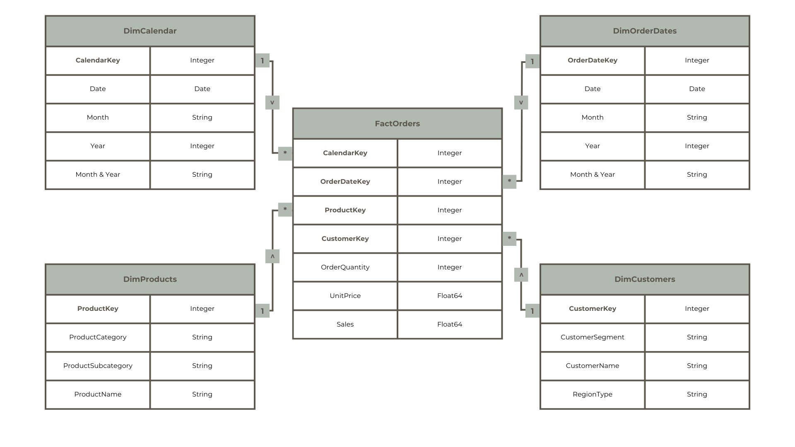

# README: Online Shopping Behavior Analysis - Evergreen Office

---

## **Table of Contents**

1. [Background and Overview](#background-and-overview)
2. [Data Structure Overview](#data-structure-overview)
3. [Executive Summary](#executive-summary)
4. [Insights Deep Dive](#insights-deep-dive)
5. [Recommendations](#recommendations)

---

## **Background and Overview**

### **Company Context**
The dataset originates from a company that operates in Canada. The company sells products across three main categories:

1. **Furniture** (e.g., tables, chairs, office furnishings)
2. **Office Supplies** (e.g., paper, pens, binders, art supplies)
3. **Technology** (e.g., laptops, office machines, computer peripherals)

### **Objective**
The analysis spans shipped orders between **January 2009 and December 2012** and aims to answer key business questions about regional performance, customer behavior, and top-performing products.

### **Business Challenge**

Despite the company's strong foothold in technology products and corporate clients, sales trends indicate a **decline** in recent years. Alarmingly, there is no significant growth in overall sales, prompting questions on whether to focus marketing efforts on specific customer groups or regions, or to discontinue certain product categories.

Key objectives include:

- Identifying **regional performance**.
- Evaluating **customer segments**.
- Assessing **efficiency** of product categories.
- Recommending actions based on findings to improve sales and operational efficiency.

---

## **Data Structure Overview**

The dataset consists of **shipped orders** across four main tables:

- **Orders Table:** Details of 8,399 shipped orders, including product categories and sales amounts.
- **Customer Table:** Information about customers, including regions and segments.
- **Geography Table:** Regional and provincial data.
- **Dates Table:** Includes formatted date dimensions to support time-based analysis.

  

### **Key Data Transformations**

1. **Star Schema Implementation:** Fact and dimension tables were created to structure data for efficient analysis.
2. **Data Cleaning:**
   - Removed duplicate and invalid values.
   - Standardized date formats.
   - Verified consistency in sales calculations.
3. **Customer Identification:** A surrogate key was created by combining attributes such as customer name, province, and segment. Each unique combination was treated as a distinct customer.
4. **Sales Adjustment:** Erroneous values in sales were corrected based on recalculated formulas (unit price \* quantity - discount + shipping cost).

---

## **Executive Summary**

### **Key Findings:**

1. **Regional Performance:**

   - **West Region** generates the highest sales ($6.4M, 38% of total revenue).
   - **Atlantic and North Regions** show lower sales volumes but are more consistent in order distribution.

2. **Product Categories:**

   - **Office Supplies** accounts for the highest number of orders (3,700) but has the **lowest average order value** ($720-$880).
   - **Technology** contributes the highest revenue per order ($2,670-$3,140).

3. **Customer Segments:**

   - Corporate clients dominate sales, contributing 46% of total revenue.
   - Small businesses show potential but currently contribute the least.

4. **Sales Trends:**

   - Sales peaked in 2009 ($4.18M) but declined significantly by 2011 ($3.43M).
   - 2012 shows signs of recovery, indicating possible opportunities for targeted strategies.

---

## **Insights Deep Dive**

### **1. Regional Insights**

- The **West Region** leads in sales across all categories but has the largest share of **technology products**.
- **Office Supplies** have a disproportionate share of orders in all regions but do not translate to equivalent revenue. This raises questions about **profitability and operational costs** for this category.

| Region   | Total Sales (2009-2012) | Dominant Category | Avg. Order Value |
| -------- | ----------------------- | ----------------- | ---------------- |
| West     | $6.4M                  | Technology        | $2,850          |
| Central  | $4.5M                  | Technology        | $2,750          |
| Atlantic | $2.0M                  | Office Supplies   | $870            |
| North    | $1.9M                  | Office Supplies   | $840            |

### **2. Product Performance**

- Top-performing product (by value): **Polycom ViewStation ISDN Videoconferencing Unit** ($265,794 in sales).
- Top-performing product (by volume): **Global High-Back Leather Tilter Chair** (666 units sold).
- **Office Supplies** products have the highest order count but generate the lowest revenue. Costs associated with fulfillment should be reviewed.

### **3. Customer Behavior**

- Corporate customers placed 2,100 orders (50% higher than other segments).
- **Small Businesses** and **Home Office** customers show potential for growth with targeted marketing strategies.

---

## **Recommendations**

1. **Product Portfolio Optimization:**

   - Evaluate **Office Supplies** profitability. High order volumes and low average order values indicate a potential strain on operational efficiency.
   - Focus on promoting high-margin products in **Technology** and **Furniture**.

2. **Regional Marketing Strategies:**

   - Target the **West Region** with technology-based promotions to leverage existing trends.
   - Develop specific campaigns for **North and Atlantic Regions** to improve sales and customer engagement.

3. **Customer Segmentation:**

   - Strengthen marketing for **Corporate Clients**, who drive the majority of sales.
   - Provide personalized offers to **Small Businesses** to increase their share of revenue.

4. **Operational Efficiency:**

   - Assess the cost structure of **Office Supplies** orders. Consider consolidation or minimum order requirements to reduce costs.

5. **Sales Recovery Plan:**

   - Capitalize on the 2012 recovery trend with seasonal promotions and loyalty programs.
   - Investigate the impact of shipping speed and explore expedited delivery options to enhance customer satisfaction.


2. Reference the image in the README using the following Markdown syntax:

   ```markdown
   
