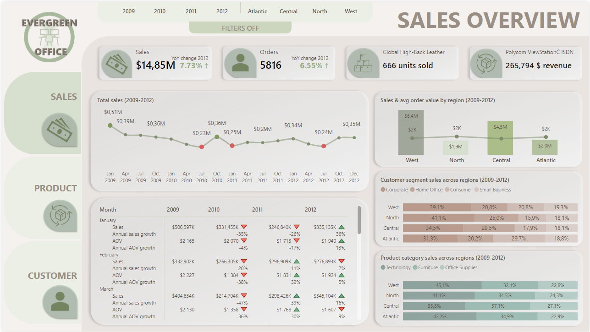

# Online Shopping Behavior Analysis - Evergreen Office

---

## **Table of Contents**

1. [Project Background](#project-background)
   - [Company Context](#company-context)
   - [Key Focus Areas](#key-focus-areas)
   - [Data Structure](#data-structure)
2. [Executive Summary](#executive-summary)
   - [Overview of Findings](#overview-of-findings)
   - [Insights Deep Dive](#insights-deep-dive)
     - [Sales Trends](#sales-trends)
     - [Product Performance](#product-performance)
     - [Customer Distribution](#customer-distribution)
     - [Regional Comparisons](#regional-comparisons)
6. [Recommendations](#recommendations)
7. [Assumptions and Caveats](#assumptions-and-caveats)

---

## **Project Background**

### **Company Context**
Evergreen, established in 2009, is a global company specializing in office equipment sales in Canada via its website and mobile app.

Despite its strong foothold in technology products and corporate clients, the company has experienced a **decline in sales** over the past years. This downturn, starting in 2010, continued through 2011, with a brief recovery in 2012. This has raised critical questions about the effectiveness of current strategies, prompting discussions on whether to focus marketing efforts on specific customer groups or regions, or to discontinue certain product categories.

Evergreen holds extensive data on sales, operational efficiency, product offerings, and customer distribution. However, this data has not been fully utilized to inform strategic decision-making. This project thoroughly analyzes and synthesizes these data points to uncover actionable insights aimed at improving Evergreen's commercial success.

### **Key Focus Areas**

This analysis provides insights and recommendations in the following domains:
- **Sales Trends:** Evaluating historical sales patterns with a focus on revenue, order volume, and average order value.
- **Product Performance:** Conducting a detailed analysis of product categories and individual product success, assessing contributions to revenue and order volume over time.
- **Customer Distribution:** Analyzing customer segmentation by type and geography, focusing on shifts in customer behavior and purchasing trends.
- **Regional Comparisons:** Examining how different regions contribute to overall performance, including sales, product preferences, and growth trends.

An interactive Power BI dashboard showcasing these insights is available [here](https://app.powerbi.com/reportEmbed?reportId=d6f8ba80-15d9-4cb6-8294-d6fe67e4b544&autoAuth=true&ctid=18a34f25-7887-4c8e-9e8b-1916ddf307d5).

## **Data Structure**

The database structure, shown below, is based on a star schema and consists of four **dimensional tables**: Calendar, OrderDates, Products, Customers, as well as one **fact table** (FactOrders), containing a total of 8,399 records. The analysis spans shipped orders between **January 2009 and December 2012**.

  

    

Before starting the analysis, several quality control and data exploration steps were performed using Power Query and Excel. These checks ensured data accuracy and consistency while providing familiarity with the dataset. Details of the quality checks and data validation processes can be found here.

## **Executive Summary**

### **Overview of Findings**

In its first year of operations, Evergreen achieved a revenue of 4.18 million USD, but subsequently experienced a notable decline in sales during the following two years—down by 15.43% in 2010 and 2.72% in 2011. While 2012 saw a sales growth of 7.73%, it is concerning that the average order value (AOV) in two key product segments—technology (-2%) and furniture (-11%)—continued to decrease. This decline, despite some recovery in 2012, can largely be attributed to a return to pre-crisis conditions.

The impact of the 2008 financial crisis, while significant in the earlier years, might have had lingering effects on market dynamics. However, the fact that Canadian financial institutions operate under stricter regulations, suggests that the direct impact of the U.S. financial crisis on Canadian businesses like Evergreen should have been somewhat mitigated by these regulatory safeguards. The following sections will further investigate additional contributing factors and identify key opportunities for improvement.

Below is the overview page from PowerBI dashboard and more examples are included throught the report. The entire interactive dashboard can be downloaded here. 

  

    

## **Insights Deep Dive**

### **Sales Trends**

- Evergreen's sales trends demonstrate significant variability since the company’s launch in 2009. **The inaugural year began strong, with the highest revenue recorded in January at $506,597 from 144 orders.** However, sales quickly fluctuated, **dropping to $230,767 in May** and recovering to $409,164 in December.

  

    

- **2010 saw a general decline in sales, finishing 15.43% lower than 2009**. The year started with weak performance and experienced sharp drops in July and August. Despite this, **the final quarter of 2010 achieved the best results of the year, generating $1,022,036 in revenue**.
  
  

    

- **In 2011, sales hit their lowest point in June, with revenue of $197,941.** Although the last quarter was again the strongest, overall annual performance remained weaker compared to prior years. A notable finding is that **consumer orders increased slightly (+5.82%), but revenue from these orders dropped significantly (-27.92%)**. Small business clients showed a similar pattern, with a small rise in order volume but a decrease in revenue.
  
  

    

- **2012 marked some recovery, with an overall sales increase of 7.73% compared to 2011.** Improvements were particularly notable in the consumer and small business segments, driven by strategic changes in free delivery policies. For instance, consumer orders rose by +33.33%, while revenue from these orders increased by +127.8%, likely reflecting the impact of the higher free delivery threshold introduced in 2012. In the small business segment, the earlier introduction of this policy in 2011 resulted in sustained growth, with a +9.93% increase in revenue and a +6.88% rise in orders in 2012. Despite these gains, several months in 2012 still underperformed compared to earlier benchmarks from 2009.
  
  

    

- Recurring sales patterns in Evergreen demonstrate significant variability, with **peak performance often occurring either in the final quarter or the first quarter of the year**. While end-of-year peaks are typically followed by weaker first quarters, there are also instances where strong first-quarter performance corresponds with a softer preceding fourth quarter. These fluctuations are likely driven by client behaviors such as **tax planning and budget adjustments, particularly among corporate and small business clients**, who may adjust their purchasing strategies based on annual financial results.

### **Product Performance**

    

- Product performance in Evergreen has demonstrated notable variability. **The top-performing product, the Polycom ViewStation ISDN Videoconferencing Unit, generated $265,794 in revenue**, peaking at $170k in 2009. However, sales dropped significantly in 2010 and 2011, before rebounding by +142% in 2012, reaching $49k. The second-highest performer, the Global Troy Executive Leather Low-Back Tilter, showed steady sales, with a notable increase in 2012, reaching $67k in the Central region.

- **Technology consistently led, accounting for 41-42% of total sales, followed by Furniture (31-37%) and Office Supplies, which grew from 22% in 2011 to 26% in 2012**. Despite these shifts, some Office Supplies subcategories, like Pens & Art Supplies and Rubber Bands, contributed very little, with some products selling under 1% of total sales. These low performers accounted for only 0.093% of total sales (USD 13,764), suggesting a potential opportunity to phase out such products, especially those introduced before 2012, without significantly impacting overall sales.

- In terms of order volume, **Office Supplies led with the highest number of orders, totaling 3.7k orders.** This category saw a steady stream of smaller orders, contributing to its overall growth. Technology followed with 1.9k orders, while Furniture had 1.6k orders. Despite having fewer orders than Office Supplies, Technology and Furniture typically commanded higher order values, reflecting the difference in product pricing and customer purchase behavior.

- The Average Order Value (AOV) varied across categories. **Technology and Furniture had higher AOVs, around $3,100 in 2009, driven by more expensive items like copiers and furniture.** By 2011, AOV dropped to $2,800 due to a shift towards lower-priced products, before slightly recovering to $2,900 in 2012. In contrast, **Office Supplies had the lowest AOV, dropping to $913 in 2012, reflecting the smaller ticket size of items like pens and art materials.**

    

### **Customer Distribution**

    

- **Corporate (avg. 37%) and Home Office (avg. 24%)** segments dominated in terms of sales value, reinforcing their significant contribution to overall revenue.
  
- **Corporate** maintained the largest share of total sales, with its contribution growing **from 36% in 2009 to 40% in 2012**, solidifying its position as the main revenue driver.
  
- **Consumer and Small Business segments saw some fluctuations but generally remained stable.** The Consumer segment accounted for 23% in 2009, stabilizing around 19% by 2012, while the Small Business segment demonstrated consistent growth, increasing from 18% in 2009 to 20% in 2012.
  
- Despite fluctuations in the **Average Order Value (AOV)** across segments, ranging from the highest value of 2,059 USD in the Consumer segment in 2009 to the lowest average of 1,532 USD in the Home Office segment in 2012, **the average order value across all segments during the analyzed period averages around $1.7k**.
  
- In terms of **order volume, Corporate** consistently accounted for the highest share, making up **36% of total orders** over the period, with a steady increase, reaching 548 orders in 2012. **Home Office maintained a more stable volume representing around 24% of total orders. Meanwhile, the Consumer and Small Business segments contributed about 40% of the total orders**, with both segments showing similar order volumes throughout the period.
  
- **Corporate** segment consistently displayed the highest Average Order Value (AOV), reflecting **larger purchase volumes or more premium products.** In contrast, the **Consumer** segment had the lowest AOV, suggesting a focus on more **basic items.** Over the analyzed period, the **Small Business segment saw the most notable growth in AOV, indicating a shift in purchasing behavior towards higher-value items.**

    

### **Regional Comparisons**

- **The West region stands out as the top performer, with the highest revenue at $6.4 million**, showing steady growth (7%) and a strong number of orders (2,489). In contrast, **the North region is at the bottom of the list, with only $1.9 million in sales**, a significant decline of 28% in 2012, largely due to poor performance in technology and furniture sectors.
  
- The West region not only leads in revenue but also in order volume, with 2,489 orders and a modest AOV growth of 1%. **The North region, facing significant challenges, has the lowest AOV ($1,913), a steep decline in AOV (-24%) in 2012, and a poor number of orders (721), highlighting the struggles in both order quantity and quality.**
  
- Meanwhile, Atlantic and Central both saw positive growth in 2012, with **Atlantic's sales increasing by 37% to $0.49M **. **Central, on the other hand, showed an 18% increase in 2012 sales, reaching $1.16M, with solid growth in office supplies (+43%) and small business (+54%).** However, both regions still have lower overall performance than their respective peaks in 2009.
  
- **Technology**, despite being the best-performing product category, **experienced significant declines across most regions in 2010-2011.** The exception was North in 2010, where technology saw a growth of +27%, and West in 2011, which had a +19% increase. However, in 2012, technology in North faced a sharp decline of 32%, though it was offset by growth in all other regions, making it the first year of overall growth for the category.
  
- **Office supplies** faced early challenges but showed positive growth in 2012 following fluctuations in 2010 and 2011. **North was the only region to experience growth in 2010 (+4%) and 2011 (+3%)**, but it saw a decline of -14% in 2012. Atlantic and Central both saw declines in 2010 (-18% and -19%, respectively) and in 2011 (-10% and -25%). West also struggled in 2010 (-11%) and 2011 (-3%). However, **in 2012, Atlantic and Ceentral rebounded strongly with +45% and +43% growth, while West showed a +25% increase.**

<table align="center" style="width: 80%; text-align: center;">
  <tr>
    <td>
      
      
Atlantic

    </td>
    <td>
      
      
Central

    </td>
  </tr>
  <tr>
    <td>
      
      
North

    </td>
    <td>
      
      
West

    </td>
  </tr>
</table>

  
- **The consumer segment in the Atlantic saw a strong recovery in 2012 (+128%)**, after significant drops in 2010 (-39%) and 2011 (-67%). **Small business**, which had a sharp decline in 2011 (-42%), **rebounded strongly in 2012 (+120%)**, while corporate sales continued to decline throughout the period. Home Office also recovered after a sharp drop in 2010 (-24%), with growth in the following years (+13% in 2011, +6% in 2012).

- **Central experienced notable fluctuations**, especially in small business, which had significant drops in 2010 (-33%) and 2012 (-7%). **North remained relatively stable**, with significant growth in consumer sales in 2012 (+66%) despite earlier declines in 2010 and 2011. **The West showed a stabilizing trend in 2012**, with small business and home office sales recovering after large fluctuations in 2010 and 2011. Corporate sales in the West began to recover in 2011 (+10%) and continued to improve in 2012 (+43%).

<table align="center" style="width: 80%; text-align: center;">
  <tr>
    <td>
      
      
Atlantic

    </td>
    <td>
      
      
Central

    </td>
  </tr>
  <tr>
    <td>
      
      
North

    </td>
    <td>
      
      
West

    </td>
  </tr>
</table>

## **Recommendations**

1. **Product Portfolio Optimization:**

   - Evaluate **Office Supplies** profitability. High order volumes and low average order values indicate a potential strain on operational efficiency.
   - Focus on promoting high-margin products in **Technology** and **Furniture**.

2. **Regional Marketing Strategies:**

   - Target the **West Region** with technology-based promotions to leverage existing trends.
   - Develop specific campaigns for **North and Atlantic Regions** to improve sales and customer engagement.

3. **Customer Segmentation:**

   - Strengthen marketing for **Corporate Clients**, who drive the majority of sales.
   - Provide personalized offers to **Small Businesses** to increase their share of revenue.

4. **Operational Efficiency:**

   - Assess the cost structure of **Office Supplies** orders. Consider consolidation or minimum order requirements to reduce costs.

5. **Sales Recovery Plan:**

   - Capitalize on the 2012 recovery trend with seasonal promotions and loyalty programs.
   - Investigate the impact of shipping speed and explore expedited delivery options to enhance customer satisfaction.

## **Assumptions and Caveats**

**Customer Identification:** The surrogate key for customers was initially created based on a combination of customer name, region, province, and segment. However, this approach led to multiple records for a single customer when an order was split across different delivery addresses or included purchases for both business and personal purposes. To address this, a new surrogate key was implemented, merging the customer dimension table with the fact table using a unique row number (rownr) and customer name. This allows for consistent mapping of each line in the fact table to the correct region and segment.

**Handling Multiple Deliveries and Customers per Order:** There were cases where a single order was split for delivery to multiple addresses or involved multiple recipients. To resolve this, the assumption was made that each unique order, based on customer details and delivery information, would be treated as a separate entity for analysis. Each order with distinct delivery details is now treated as an independent transaction, with customer keys assigned based on combinations of customer name, region, province, and segment.

**Customer Segmentation and Recurring Customers:** In analyzing customer behavior, the assumption is made that a single customer may have multiple purchasing purposes or operate across different regional branches. As such, customer segmentation is based on a combination of their name and regional attributes, allowing for differentiated tracking. To identify returning customers, frequency of orders within a specific time period is used as the key metric.

**Sales Data Corrections:** During data review, certain discrepancies were identified in the SALES values within the fact table. These were corrected through recalculations to ensure consistency with expected values. Additionally, unreliable columns such as PROFIT and MARGIN were removed to ensure the analysis focused on valid data.

**Sales Calculation Discrepancies:** It was noted that the formula Unit price * Quantity - Discount + Shipping cost did not always align with the recorded SALES values. Efforts were made to address this inconsistency in the final dataset.

Note: The data used in this report is fictional and sourced from [the Online Shopping Consumer Behavior Dataset available on Kaggle]( https://www.kaggle.com/datasets/thedevastator/online-shopping-consumer-behavior-dataset). It has been generated solely for analytical purposes. The full report and analysis can be accessed on GitHub.
